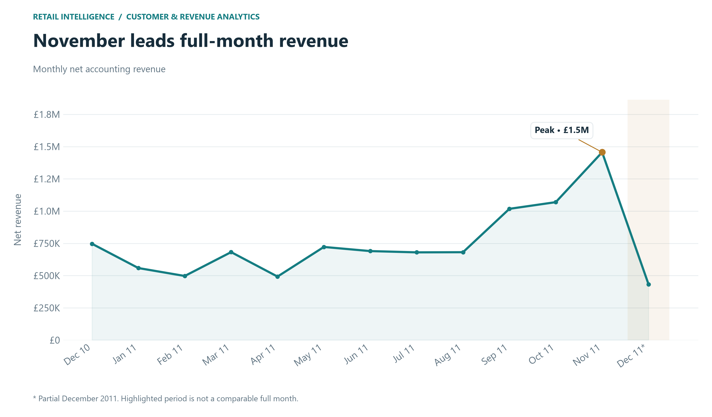
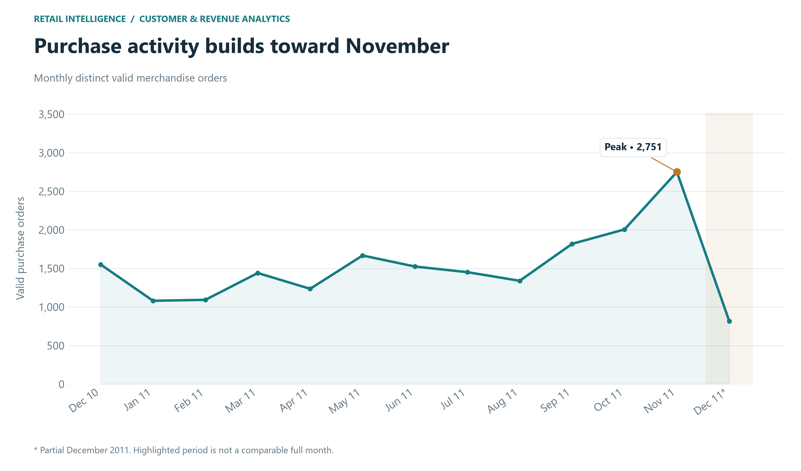
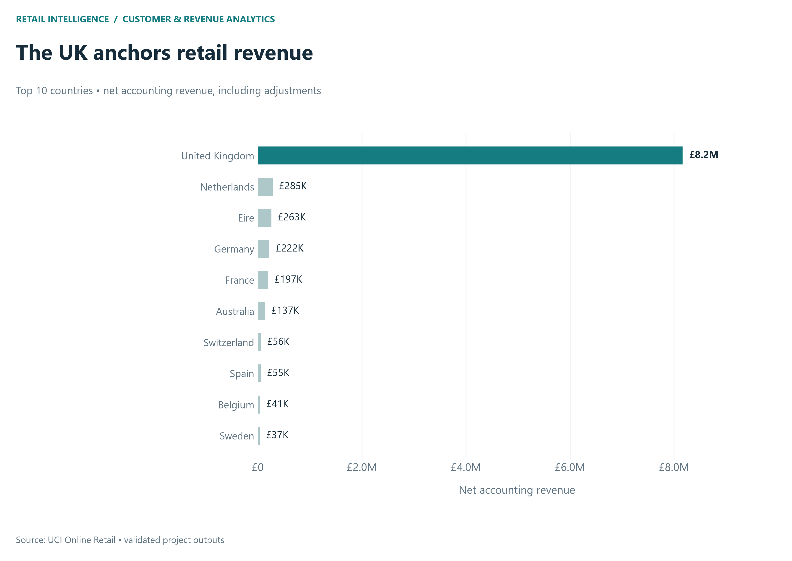
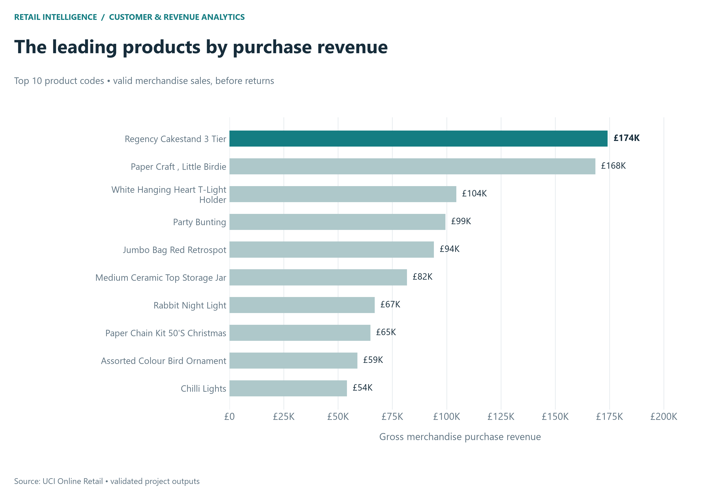
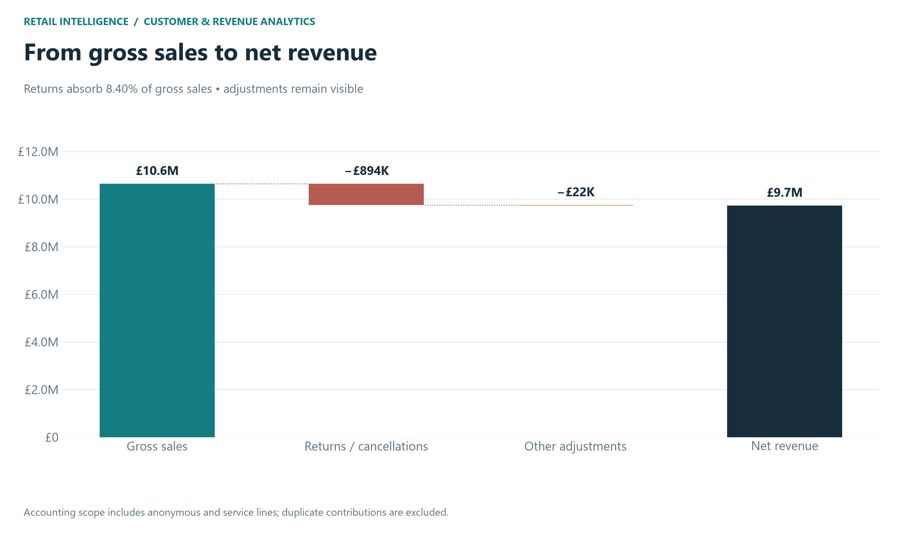
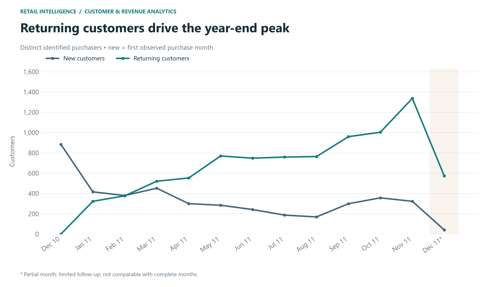
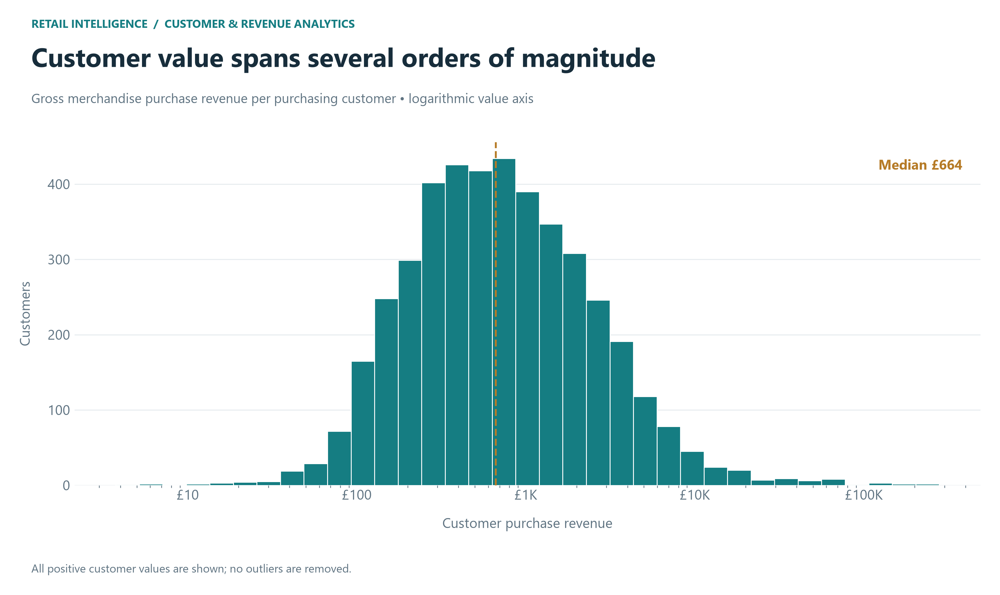

# Phase 3 — Business KPI engine and revenue analysis

## Reproduce

Run from the project root: python -m pip install -r requirements.txt; then python scripts/run_phase3.py; then python -m unittest discover -s tests -v. Use the project's .venv Python executable. Phase 3 consumes the existing transactions.csv.gz and never reruns Phase 2 or changes its rules.

## Revenue reconciliation and scope

| component | signed_gbp |
| --- | --- |
| Gross sales | 10,642,110.80 |
| Returns / cancellations | -893,979.73 |
| Other adjustments | -22,124.12 |
| Net revenue | 9,726,006.95 |

Gross sales sums Phase 2 gross_purchase_revenue: nonduplicate, positive-price, positive-quantity, noncancellation lines. Returns/cancellations sum return_cancellation_value: nonduplicate, positive-price negative-quantity or C-prefixed lines, with signed line values negated. Signed other_adjustment_revenue includes the negative-price bad-debt entries. Net revenue = gross sales - returns + signed adjustments (equivalently subtract the adjustment deduction). The bridge includes anonymous customers and service lines. Duplicate contributions are zero; their original signed value is £21,740.98. Zero prices contribute zero, including all 1,336 negative-quantity rows without C prefixes. Unusual rows remain in the Phase 2 ledger.

Valid customer purchase revenue sums line_revenue only where is_customer_purchase is True. Valid merchandise purchases use is_valid_purchase, including anonymous customers. Neither purchase scope is interchangeable with accounting net revenue. Existing description and validity flags are reused unchanged.

## KPI definitions

Total valid orders = distinct InvoiceNo among is_valid_purchase rows; valid customer orders use is_customer_purchase. Unique purchasing customers excludes anonymous and return-only identities. AOV = valid merchandise purchase revenue / total valid orders. Customer AOV uses identified purchase revenue / identified purchase orders. Items per order uses purchase Quantity / valid orders. Revenue per customer = identified purchase revenue / distinct purchasing customers. Average frequency = identified purchase orders per purchaser.

Return value rate = accounting returns / accounting gross sales. Return invoice ratio = distinct nonduplicate reversal invoices / valid purchase orders; return row rate = nonduplicate reversal rows / all nonduplicate rows. These ratios do not match reversals to originating orders. Overall repeat-customer rate = purchasers with at least two orders / all purchasers. Single-order versus repeat counts are mutually exclusive. Monthly new customers have their first observed valid purchase that month; monthly returning customers purchased in an earlier month. A new customer who repeats within the same month remains in the monthly new category.

## Calculated executive KPIs

| metric | value |
| --- | --- |
| raw_rows_used | 541909 |
| valid_purchase_rows | 522716 |
| valid_customer_purchase_rows | 391286 |
| gross_sales | 10642110.804000001 |
| return_cancellation_value | 893979.73 |
| signed_adjustments | -22124.12 |
| adjustment_deduction | 22124.12 |
| net_revenue | 9726006.954 |
| valid_purchase_revenue | 10268780.273 |
| valid_customer_purchase_revenue | 8743913.643 |
| total_valid_orders | 19780 |
| valid_customer_purchase_orders | 18405 |
| unique_purchasing_customers | 4334 |
| unique_identified_ledger_customers | 4372 |
| aov | 519.149659908999 |
| customer_purchase_aov | 475.083599185004 |
| average_items_per_order | 281.17118301314457 |
| revenue_per_customer | 2017.5158382556529 |
| return_value_rate_pct | 8.400398628287013 |
| return_invoice_to_purchase_order_pct | 26.14762386248736 |
| return_row_rate_pct | 1.9728272718633126 |
| repeat_customer_rate_pct | 65.27457314259345 |
| repeat_customers | 2829 |
| single_purchase_customers | 1505 |
| average_purchase_frequency | 4.246654360867558 |
| recency_reference_date | 2011-12-10 |
| all_observed_unique_invoices | 25900 |
| return_only_or_no_valid_purchase_customers | 38 |
| negative_without_c_rows | 1336 |
| negative_without_c_signed_value | 0.0 |
| duplicate_signed_value | 21740.98 |
| multi_country_valid_invoices | 0 |
| multi_customer_valid_invoices | 0 |
| products_with_multiple_purchase_descriptions | 220 |
| best_complete_month | 2011-11 |
| weakest_complete_month | 2011-04 |
| strongest_observed_month | 2011-11 |
| top_country | United Kingdom |
| top_product_code | 22423 |
| top_product_description | REGENCY CAKESTAND 3 TIER |
| top_3_country_net_share_pct | 89.60288785744581 |
| top_1pct_customer_count | 44 |
| top_1pct_customer_purchase_revenue_share_pct | 32.23337552351442 |

## Monthly results and period handling

| month | gross_purchase_revenue | return_cancellation_value | other_adjustment_revenue | net_revenue | orders | unique_customers | valid_purchase_revenue | aov | new_customers | repeat_customers | is_partial | net_revenue_growth_pct_observed | net_revenue_growth_pct_complete |
| --- | --- | --- | --- | --- | --- | --- | --- | --- | --- | --- | --- | --- | --- |
| 2010-12 | 821,452.73 | 74,729.12 | 0.00 | 746,723.61 | 1,552.00 | 884.00 | 789,856.28 | 508.93 | 884.00 | 0.00 | False | N/A | N/A |
| 2011-01 | 689,811.61 | 131,363.05 | 0.00 | 558,448.56 | 1,081.00 | 739.00 | 670,639.46 | 620.39 | 416.00 | 323.00 | False | -25.21 | -25.21 |
| 2011-02 | 522,545.56 | 25,519.15 | 0.00 | 497,026.41 | 1,093.00 | 757.00 | 508,081.54 | 464.85 | 380.00 | 377.00 | False | -11.00 | -11.00 |
| 2011-03 | 716,215.26 | 34,201.28 | 0.00 | 682,013.98 | 1,441.00 | 973.00 | 690,811.60 | 479.40 | 452.00 | 521.00 | False | 37.22 | 37.22 |
| 2011-04 | 536,968.49 | 44,600.65 | 0.00 | 492,367.84 | 1,236.00 | 853.00 | 515,899.66 | 417.39 | 300.00 | 553.00 | False | -27.81 | -27.81 |
| 2011-05 | 769,296.61 | 47,202.51 | 0.00 | 722,094.10 | 1,668.00 | 1,054.00 | 740,472.33 | 443.93 | 284.00 | 770.00 | False | 46.66 | 46.66 |
| 2011-06 | 760,547.01 | 70,569.78 | 0.00 | 689,977.23 | 1,525.00 | 990.00 | 738,233.99 | 484.09 | 242.00 | 748.00 | False | -4.45 | -4.45 |
| 2011-07 | 718,076.12 | 37,919.13 | 0.00 | 680,156.99 | 1,452.00 | 946.00 | 688,802.67 | 474.38 | 187.00 | 759.00 | False | -1.42 | -1.42 |
| 2011-08 | 757,841.38 | 54,330.80 | -22,124.12 | 681,386.46 | 1,340.00 | 933.00 | 724,708.16 | 540.83 | 169.00 | 764.00 | False | 0.18 | 0.18 |
| 2011-09 | 1,056,435.19 | 38,838.51 | 0.00 | 1,017,596.68 | 1,819.00 | 1,259.00 | 1,029,245.38 | 565.83 | 299.00 | 960.00 | False | 49.34 | 49.34 |
| 2011-10 | 1,151,263.73 | 81,895.50 | 0.00 | 1,069,368.23 | 2,006.00 | 1,361.00 | 1,104,063.97 | 550.38 | 357.00 | 1,004.00 | False | 5.09 | 5.09 |
| 2011-11 | 1,503,866.78 | 47,720.98 | 0.00 | 1,456,145.80 | 2,751.00 | 1,660.00 | 1,453,265.98 | 528.27 | 323.00 | 1,337.00 | False | 36.17 | 36.17 |
| 2011-12 | 637,790.33 | 205,089.27 | 0.00 | 432,701.06 | 816.00 | 614.00 | 614,699.25 | 753.31 | 41.00 | 573.00 | True | -70.28 | N/A |

Boundary coverage is evaluated by calendar date, not midnight timestamps: December 2010 starts on day 1 and is treated as calendar-covered; December 2011 ends on day 9 and is partial. Calendar coverage does not prove source completeness. Observed growth is provided separately; comparable growth is null when either adjacent month is partial. First-period growth is undefined. Monthly customers are not additive across months.

## Geographic results

| Country | gross_purchase_revenue | return_cancellation_value | other_adjustment_revenue | net_revenue | orders | customers | valid_purchase_revenue | aov | revenue_contribution_pct | return_value_rate_pct | return_invoices |
| --- | --- | --- | --- | --- | --- | --- | --- | --- | --- | --- | --- |
| United Kingdom | 9,001,744.09 | 812,491.79 | -22,124.12 | 8,167,128.18 | 17,905.00 | 3,916.00 | 8,740,428.62 | 488.16 | 83.97 | 9.03 | 4,708.00 |
| Netherlands | 285,446.34 | 784.80 | 0.00 | 284,661.54 | 93.00 | 9.00 | 283,889.34 | 3,052.57 | 2.93 | 0.27 | 6.00 |
| EIRE | 283,140.52 | 20,147.14 | 0.00 | 262,993.38 | 284.00 | 3.00 | 276,090.86 | 972.15 | 2.70 | 7.12 | 72.00 |
| Germany | 228,678.40 | 7,168.93 | 0.00 | 221,509.47 | 443.00 | 94.00 | 205,381.15 | 463.61 | 2.28 | 3.13 | 146.00 |
| France | 209,625.37 | 12,308.26 | 0.00 | 197,317.11 | 383.00 | 87.00 | 184,679.00 | 482.19 | 2.03 | 5.87 | 69.00 |
| Australia | 138,453.81 | 1,444.04 | 0.00 | 137,009.77 | 56.00 | 9.00 | 138,103.81 | 2,466.14 | 1.41 | 1.04 | 12.00 |
| Switzerland | 57,067.60 | 704.55 | 0.00 | 56,363.05 | 50.00 | 21.00 | 53,065.60 | 1,061.31 | 0.58 | 1.23 | 20.00 |
| Spain | 61,558.56 | 6,802.53 | 0.00 | 54,756.03 | 88.00 | 30.00 | 55,706.56 | 633.03 | 0.56 | 11.05 | 15.00 |
| Belgium | 41,196.34 | 285.38 | 0.00 | 40,910.96 | 98.00 | 25.00 | 36,927.34 | 376.81 | 0.42 | 0.69 | 21.00 |
| Sweden | 38,367.83 | 1,782.42 | 0.00 | 36,585.41 | 34.00 | 8.00 | 36,828.83 | 1,083.20 | 0.38 | 4.65 | 10.00 |
| Japan | 37,416.37 | 2,075.75 | 0.00 | 35,340.62 | 19.00 | 8.00 | 37,416.37 | 1,969.28 | 0.36 | 5.55 | 9.00 |
| Norway | 36,165.44 | 1,001.98 | 0.00 | 35,163.46 | 32.00 | 10.00 | 32,454.64 | 1,014.21 | 0.36 | 2.77 | 4.00 |

Country revenue and contribution use accounting net; country orders, customers and AOV use valid merchandise purchases. Country return rates use accounting return value / gross sales. Countries with zero denominators retain undefined ratios. Country customer counts are distinct within each country and need not sum to global customers.

## Product results

| StockCode | description | gross_revenue | quantity | purchase_orders | return_value | net_revenue |
| --- | --- | --- | --- | --- | --- | --- |
| 22423 | REGENCY CAKESTAND 3 TIER | 174,156.54 | 13,851.00 | 1,988.00 | 9,697.05 | 164,459.49 |
| 23843 | PAPER CRAFT , LITTLE BIRDIE | 168,469.60 | 80,995.00 | 1.00 | 168,469.60 | 0.00 |
| 85123A | WHITE HANGING HEART T-LIGHT HOLDER | 104,462.75 | 37,641.00 | 2,198.00 | 6,624.30 | 97,838.45 |
| 47566 | PARTY BUNTING | 99,445.23 | 18,283.00 | 1,685.00 | 1,201.35 | 98,243.88 |
| 85099B | JUMBO BAG RED RETROSPOT | 94,159.81 | 48,371.00 | 2,089.00 | 1,984.02 | 92,175.79 |
| 23166 | MEDIUM CERAMIC TOP STORAGE JAR | 81,700.92 | 78,033.00 | 247.00 | 77,479.64 | 4,221.28 |
| 23084 | RABBIT NIGHT LIGHT | 66,870.03 | 30,739.00 | 994.00 | 208.40 | 66,661.63 |
| 22086 | PAPER CHAIN KIT 50'S CHRISTMAS  | 64,875.59 | 19,329.00 | 1,160.00 | 1,160.35 | 63,715.24 |
| 84879 | ASSORTED COLOUR BIRD ORNAMENT | 58,927.62 | 36,362.00 | 1,455.00 | 135.20 | 58,792.42 |
| 79321 | CHILLI LIGHTS | 54,096.36 | 10,302.00 | 661.00 | 349.70 | 53,746.66 |

Product keys are StockCode, with the most frequent observed valid-purchase Description as label and lexical tie-breaking. Return-only codes use an observed return description. Exact Phase 2 service flags are excluded. Gross revenue, quantity, and distinct purchase orders support separate rankings in products.csv. Return invoices, returned units, return value and value ratio measure reversal activity; net subtracts these from merchandise gross. Descriptions are not treated as unique product IDs. Non-product detection remains the conservative Phase 2 list.

### Most purchased by quantity

| StockCode | description | quantity |
| --- | --- | --- |
| 23843 | PAPER CRAFT , LITTLE BIRDIE | 80,995.00 |
| 23166 | MEDIUM CERAMIC TOP STORAGE JAR | 78,033.00 |
| 22197 | POPCORN HOLDER | 56,898.00 |
| 84077 | WORLD WAR 2 GLIDERS ASSTD DESIGNS | 54,951.00 |
| 85099B | JUMBO BAG RED RETROSPOT | 48,371.00 |
| 85123A | WHITE HANGING HEART T-LIGHT HOLDER | 37,641.00 |
| 21212 | PACK OF 72 RETROSPOT CAKE CASES | 36,396.00 |
| 84879 | ASSORTED COLOUR BIRD ORNAMENT | 36,362.00 |
| 23084 | RABBIT NIGHT LIGHT | 30,739.00 |
| 22492 | MINI PAINT SET VINTAGE  | 26,633.00 |

### Most frequently purchased

| StockCode | description | purchase_orders |
| --- | --- | --- |
| 85123A | WHITE HANGING HEART T-LIGHT HOLDER | 2,198.00 |
| 85099B | JUMBO BAG RED RETROSPOT | 2,089.00 |
| 22423 | REGENCY CAKESTAND 3 TIER | 1,988.00 |
| 47566 | PARTY BUNTING | 1,685.00 |
| 20725 | LUNCH BAG RED RETROSPOT | 1,565.00 |
| 84879 | ASSORTED COLOUR BIRD ORNAMENT | 1,455.00 |
| 22197 | POPCORN HOLDER | 1,392.00 |
| 22720 | SET OF 3 CAKE TINS PANTRY DESIGN  | 1,385.00 |
| 21212 | PACK OF 72 RETROSPOT CAKE CASES | 1,320.00 |
| 22383 | LUNCH BAG SUKI DESIGN  | 1,284.00 |

### Highest return/cancellation value

| StockCode | description | return_value | return_invoices | return_quantity |
| --- | --- | --- | --- | --- |
| AMAZONFEE | AMAZON FEE | 235,281.59 | 32.00 | 32.00 |
| 23843 | PAPER CRAFT , LITTLE BIRDIE | 168,469.60 | 1.00 | 80,995.00 |
| 23166 | MEDIUM CERAMIC TOP STORAGE JAR | 77,479.64 | 10.00 | 74,494.00 |
| 22423 | REGENCY CAKESTAND 3 TIER | 9,697.05 | 180.00 | 855.00 |
| CRUK | CRUK Commission | 7,933.43 | 16.00 | 16.00 |
| 85123A | WHITE HANGING HEART T-LIGHT HOLDER | 6,624.30 | 42.00 | 2,578.00 |
| 21108 | FAIRY CAKE FLANNEL ASSORTED COLOUR | 6,591.42 | 3.00 | 3,150.00 |
| 23113 | PANTRY CHOPPING BOARD | 4,803.06 | 6.00 | 946.00 |
| 48185 | DOORMAT FAIRY CAKE | 4,554.90 | 3.00 | 674.00 |
| 21175 | GIN + TONIC DIET METAL SIGN | 3,775.33 | 7.00 | 2,030.00 |

## Customer feature contract

customer_features.csv contains every identified ledger CustomerID once, renamed customer_id. first_purchase_date and last_purchase_date come from valid customer purchases. frequency_orders counts distinct valid invoices; total_quantity and gross_revenue sum those purchase lines. monetary_value aliases gross_revenue. return_count counts distinct identified positive-price merchandise reversal invoices; return_value sums their value. net_revenue = customer merchandise gross_revenue - merchandise return_value, excluding service/adjustment scope. Average order value and items per order divide gross and quantity by frequency. Recency and tenure are calendar days from last and first purchase to reference date 2011-12-10 (one day after the maximum ledger date). Customers with no valid purchases retain zero frequency/gross/quantity, missing dates/recency/tenure/AOV, and any observed returns. No RFM scoring or segmentation is performed.

## Computed business findings

1. UK net revenue is £8,167,128.18, 83.97% of the accounting total; the top three countries contribute 89.60%.
2. Top non-UK markets by net revenue: Netherlands (£284,661.54), EIRE (£262,993.38), Germany (£221,509.47).
3. 2,829 customers (65.27%) placed at least two valid orders; 1,505 placed one. The latter are a measurable follow-up audience, not proven churn.
4. Purchasing customers average 4.25 valid orders and £2,017.52 gross merchandise purchase revenue.
5. The top 44 purchasers (rounded-up top 1%) account for 32.23% of identified purchase revenue, indicating customer concentration.
6. Returns/cancellations total £893,979.73, 8.40% of accounting gross sales; this is a value ratio, not a matched-order return probability.
7. 1,336 negative-quantity rows lack C prefixes and have combined signed value £0.00; they remain visible in the ledger.
8. The best complete observed month is 2011-11 (£1,456,145.80); the weakest is 2011-04 (£492,367.84). The short history cannot establish recurring seasonality.
9. The largest comparable monthly increase is 2011-09 (49.34%); the largest decline is 2011-04 (-27.81%). Partial-month changes are excluded.
10. Top merchandise product 22423, REGENCY CAKESTAND 3 TIER, has £174,156.54 gross purchase revenue (1.70% of merchandise sales).
11. 220 product codes have multiple purchase descriptions; aggregation by code prevents splitting their revenue across labels.
12. 38 identified ledger customers have no valid merchandise purchase in the observed window; they remain in the feature table with zero frequency and missing purchase dates.

## Limitations

Missing customer IDs exclude anonymous transactions from customer behavior but not revenue. First-observed purchases are left-censored, and customers near the end have less opportunity to repeat. Returns may relate to purchases outside the observation window. No order-level return matching, VAT/shipping financial normalization, or confirmed acquisition dates are available. The dataset supports historical patterns, not causal or recurring-seasonality claims. Customer features use the full observation window; future ML requires as-of-date rebuilding and leakage-safe splits. Values inherit source floating-point precision and are rounded only for display. Valid invoices spanning multiple countries: 0; multiple identified customers: 0.

## Outputs

Modules: analytics/engine.py and analytics/charts.py. Entry point: scripts/run_phase3.py. Machine-readable metrics: reports/metrics/business_kpis.json, revenue_reconciliation.csv, monthly.csv, countries.csv, products.csv. Reusable tables: data/processed/monthly.csv, countries.csv, products.csv, customer_features.csv, valid_orders.csv. Seven charts: reports/figures/*.png. Generated data/metrics remain gitignored. Raw and ledger SHA-256 hashes before/after are in business_kpis.json.

## Charts

Stopped after Phase 3. No segmentation, ML, dashboard, README polishing, deployment or push.

## Validation result

Full existing and new suite: 19 passed, 0 failed, 0 errors. Run python scripts/run_tests.py to regenerate reports/metrics/test_results.json. All seven charts were visually inspected. Both input checksums remained unchanged.
