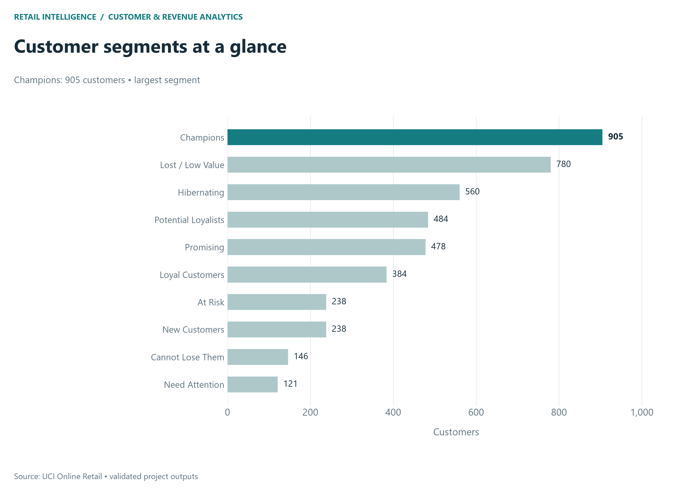
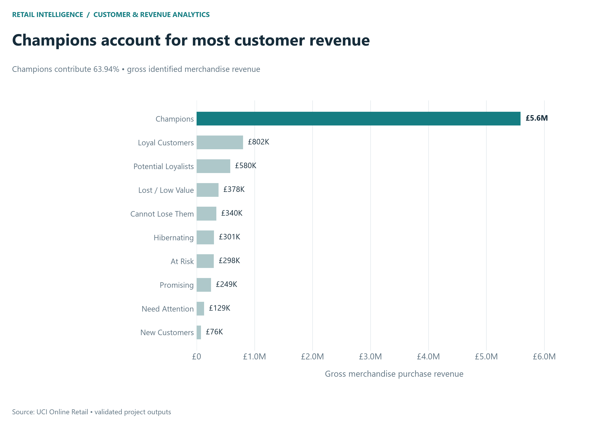
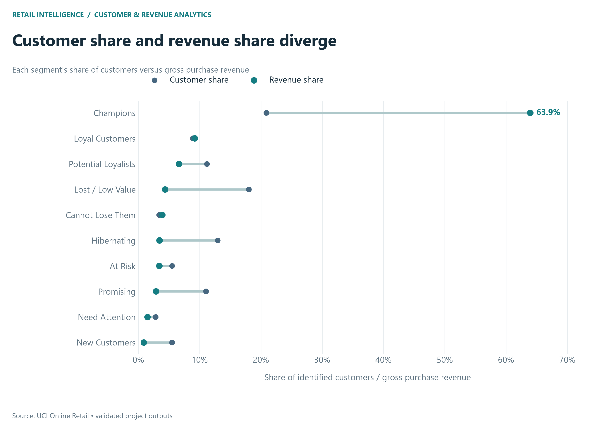
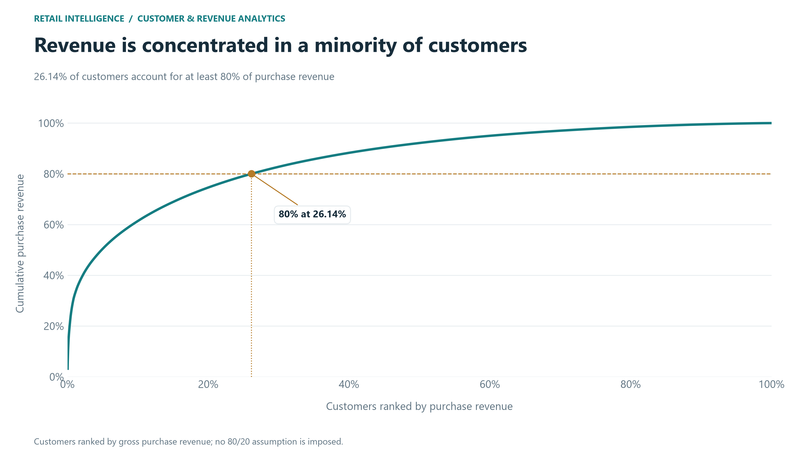
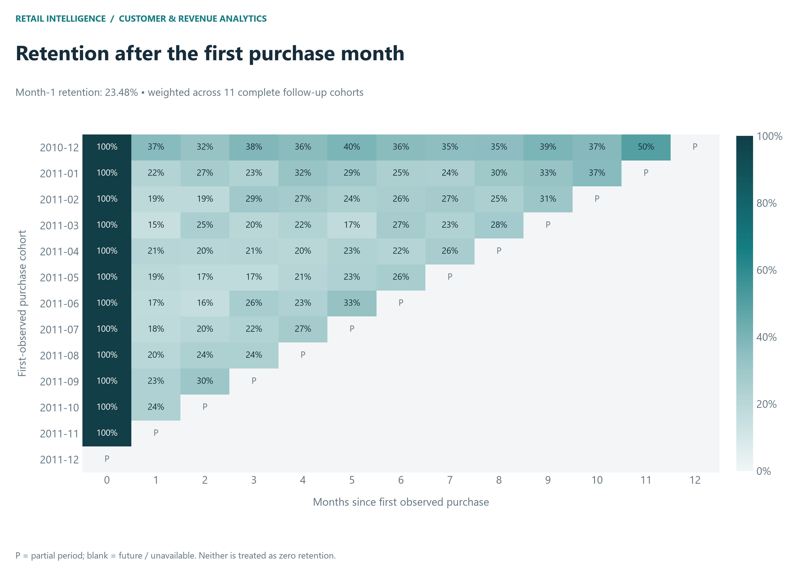
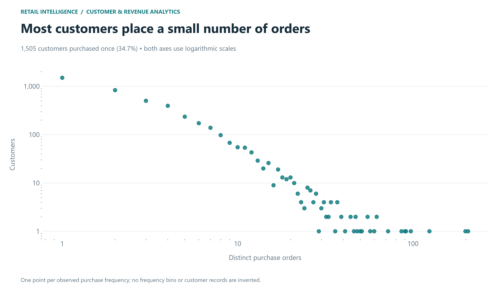
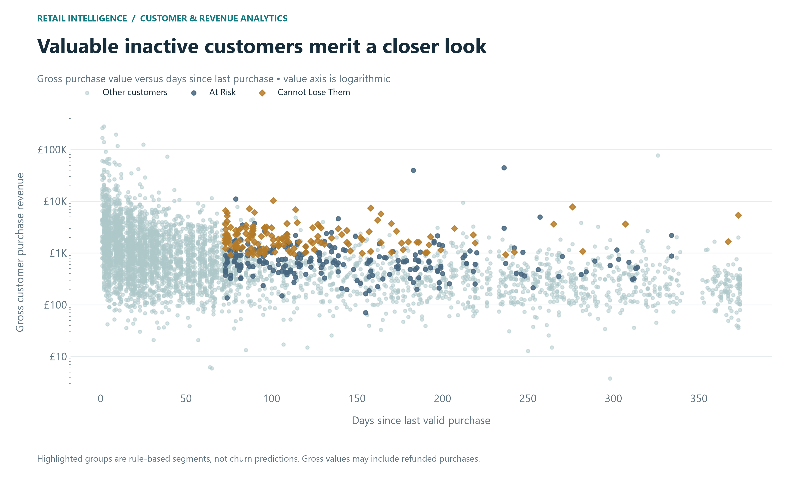

# Phase 4 — Advanced customer intelligence

## Reproduce and scope

Run python scripts/run_phase4.py using the existing project virtual environment, then python scripts/run_tests.py. Only existing Phase 2/3 inputs are read. No earlier phase is rerun, no synthetic transactions are created, and no ML or dashboard is implemented.

## Snapshot and eligibility

Snapshot: 2011-12-10, inherited from Phase 3 (one calendar day after the maximum ledger date). 4,334 identified customers with frequency >= 1 are eligible; 38 identified ledger customers with no valid merchandise purchase are excluded from RFM but remain in Phase 3. One record per eligible customer is enforced.

R = existing recency_days, calendar days since last valid purchase. F = existing frequency_orders, distinct valid invoices. M = existing monetary_value / gross_revenue from identified valid merchandise purchases, not total accounting net revenue. M sums to £8,743,913.64 and reconciles with Phase 3. Returns and net merchandise revenue remain visible in the RFM table and segment summaries. High gross purchase value does not necessarily mean high retained net value.

## Quantile scoring

For each feature, compute its empirical 20th, 40th, 60th and 80th percentiles with pandas' linear interpolation. The base score is 1 + the number of boundaries strictly less than the feature value (numpy.searchsorted with side='left'). F and M use the base score; R uses 6 minus the base score. Scores are integers from 1 to 5, where higher is better. Equal inputs always receive equal scores; duplicate boundaries are retained, so some score levels can be empty and groups need not have equal sizes. No customer-ID ranking or arbitrary tie-breaking is used for scores. Thresholds are snapshot-specific.

| feature | q20 | q40 | q60 | q80 |
| --- | --- | --- | --- | --- |
| R | 15.00 | 33.00 | 72.00 | 180.00 |
| F | 1.00 | 2.00 | 3.00 | 5.00 |
| M | 247.25 | 482.63 | 924.36 | 2,029.21 |

RFM_score concatenates the three score digits as a string. RFM_total_score is their sum (3–15); neither is a probability.

## Deterministic segment rules

Apply these rules in the listed order; the first match wins. The final fallback makes assignment exhaustive.

1. Champions: R >= 4, F >= 4, M >= 4.
2. Loyal Customers: R >= 3, F >= 4, excluding Champions.
3. Potential Loyalists: R >= 4, F in 2–3.
4. New Customers: R >= 4, F = 1.
5. Promising: R = 3, F <= 2.
6. Need Attention: remaining R >= 3.
7. Cannot Lose Them: R <= 2, F >= 4, M >= 4.
8. At Risk: remaining R <= 2, F >= 3.
9. Hibernating: remaining R = 2.
10. Lost / Low Value: all remaining customers (R = 1 and lower frequency).

Segment names are heuristic business labels. New Customers means recent and low-frequency, not a proven acquisition date. Lost / Low Value does not guarantee low monetary value; inactive one-order customers can have large gross purchases or refunds. Use the accompanying monetary and return fields before taking action.

## Actual segment profiles

| segment | customer_count | total_revenue | average_revenue_per_customer | median_revenue_per_customer | average_order_frequency | average_recency | average_aov | average_items_per_order | return_value | net_merchandise_revenue | customer_pct | revenue_pct |
| --- | --- | --- | --- | --- | --- | --- | --- | --- | --- | --- | --- | --- |
| Champions | 905.00 | 5,590,939.33 | 6,177.83 | 2,686.42 | 11.47 | 12.81 | 452.89 | 267.00 | 139,030.17 | 5,451,909.16 | 20.88 | 63.94 |
| Loyal Customers | 384.00 | 801,966.54 | 2,088.45 | 1,223.41 | 5.76 | 39.46 | 327.81 | 203.79 | 24,991.88 | 776,974.66 | 8.86 | 9.17 |
| Potential Loyalists | 484.00 | 579,820.40 | 1,197.98 | 642.37 | 2.42 | 16.93 | 518.19 | 292.53 | 174,974.60 | 404,845.80 | 11.17 | 6.63 |
| New Customers | 238.00 | 75,696.84 | 318.05 | 228.95 | 1.00 | 19.40 | 318.05 | 212.55 | 820.67 | 74,876.17 | 5.49 | 0.87 |
| Promising | 478.00 | 249,067.02 | 521.06 | 370.44 | 1.37 | 53.10 | 388.66 | 241.38 | 7,588.74 | 241,478.28 | 11.03 | 2.85 |
| Need Attention | 121.00 | 129,388.43 | 1,069.33 | 824.58 | 3.00 | 51.37 | 356.44 | 210.28 | 1,862.31 | 127,526.12 | 2.79 | 1.48 |
| Cannot Lose Them | 146.00 | 340,444.23 | 2,331.81 | 1,826.82 | 5.86 | 121.84 | 419.20 | 258.41 | 6,734.56 | 333,709.67 | 3.37 | 3.89 |
| At Risk | 238.00 | 297,991.03 | 1,252.06 | 683.51 | 3.42 | 144.74 | 400.63 | 212.45 | 27,808.59 | 270,182.44 | 5.49 | 3.41 |
| Hibernating | 560.00 | 300,660.01 | 536.89 | 371.73 | 1.38 | 119.92 | 400.34 | 266.27 | 4,590.65 | 296,069.36 | 12.92 | 3.44 |
| Lost / Low Value | 780.00 | 377,939.81 | 484.54 | 273.88 | 1.20 | 273.71 | 422.61 | 276.89 | 87,408.99 | 290,530.82 | 18.00 | 4.32 |

Average AOV and average items/order are unweighted means of per-customer ratios, not pooled order-weighted ratios. Revenue shares use identified gross merchandise purchase revenue. Empty segments keep zero count/revenue and undefined averages.

Highest value by mean gross revenue/customer: Champions (£6,177.83). Largest segment: Champions (905). Most gross revenue: Champions (£5,590,939.33). At Risk plus Cannot Lose Them contain 384 customers and £638,435.26 gross purchase revenue; their observed returns total £34,543.15. These labels are not predictive churn estimates.

## Customer concentration

| top_pct | customer_count | actual_customer_pct | revenue_share_pct |
| --- | --- | --- | --- |
| 1.00 | 44.00 | 1.02 | 32.23 |
| 5.00 | 217.00 | 5.01 | 50.45 |
| 10.00 | 434.00 | 10.01 | 61.43 |
| 20.00 | 867.00 | 20.00 | 74.61 |

1,133 customers (26.14%) reach at least 80% of customer purchase revenue. Shares select ceil(N × percentage) customers sorted by descending M, with lexical customer ID tie-breaking only at the cutoff. The table includes the actual selected percentage. The curve contains only real customers; no artificial origin record is saved. No universal 80/20 rule is assumed.

## Cohort methodology and retention

Cohort = first observed valid purchase month, not confirmed acquisition. Each customer's activity is counted once per calendar month. Retention = distinct active cohort customers / original cohort size. Month 0 observed retention is 100% by construction. Months without activity are zero only if observable; future periods have null active counts and retention. Partial periods retain observed retention separately but complete_retention is null. The heatmap masks partial cells with P and leaves future cells blank. The analytical grid enumerates cohort-age cells, not fabricated transactions or customers. December 2011 is partial; December 2010 is calendar-covered, without any claim that pre-window history is known.

| cohort | cohort_size | period_status | active_customers | retention | complete_retention |
| --- | --- | --- | --- | --- | --- |
| 2010-12 | 884.00 | complete | 323.00 | 0.37 | 0.37 |
| 2011-01 | 416.00 | complete | 91.00 | 0.22 | 0.22 |
| 2011-02 | 380.00 | complete | 71.00 | 0.19 | 0.19 |
| 2011-03 | 452.00 | complete | 67.00 | 0.15 | 0.15 |
| 2011-04 | 300.00 | complete | 63.00 | 0.21 | 0.21 |
| 2011-05 | 284.00 | complete | 54.00 | 0.19 | 0.19 |
| 2011-06 | 242.00 | complete | 42.00 | 0.17 | 0.17 |
| 2011-07 | 187.00 | complete | 33.00 | 0.18 | 0.18 |
| 2011-08 | 169.00 | complete | 34.00 | 0.20 | 0.20 |
| 2011-09 | 299.00 | complete | 70.00 | 0.23 | 0.23 |
| 2011-10 | 357.00 | complete | 84.00 | 0.24 | 0.24 |
| 2011-11 | 323.00 | partial | 36.00 | 0.11 | N/A |
| 2011-12 | 41.00 | future | N/A | N/A | N/A |

Month-1 retention across 11 complete follow-up cohorts is 23.48% weighted by cohort size; unweighted mean 21.27%, range 14.82%–36.54%. November 2011's month-1 follow-up is partial and December 2011's is future, so neither enters this summary.

## Lifecycle findings

| metric | value |
| --- | --- |
| one_time_customers | 1505 |
| repeat_customers | 2829 |
| median_frequency | 2.0 |
| median_tenure_days | 249.0 |
| mean_tenure_days | 223.83410244577757 |
| observed_order_gaps | 14071 |
| median_interpurchase_days | 22.01388888888889 |
| mean_interpurchase_days | 40.22861889899636 |
| month1_complete_cohorts | 11 |
| month1_weighted_retention | 0.23476070528967255 |
| month1_unweighted_retention | 0.21272392940287574 |
| month1_min_retention | 0.14823008849557523 |
| month1_max_retention | 0.36538461538461536 |

Order gaps use distinct (CustomerID, InvoiceNo) pairs and the earliest valid line timestamp, sorted chronologically. Same-day distinct orders are retained; gaps are fractional days. Gap statistics are interval-weighted among observed repeat orders, not estimates of a typical future wait. Tenure is snapshot minus first observed purchase date, inherited from Phase 3. First-time customers can have multiple orders in their first month but remain monthly new; returning means first purchase was in an earlier month.

| purchase_month | active_customers | new_customers | returning_customers | is_partial |
| --- | --- | --- | --- | --- |
| 2010-12 | 884.00 | 884.00 | 0.00 | False |
| 2011-01 | 739.00 | 416.00 | 323.00 | False |
| 2011-02 | 757.00 | 380.00 | 377.00 | False |
| 2011-03 | 973.00 | 452.00 | 521.00 | False |
| 2011-04 | 853.00 | 300.00 | 553.00 | False |
| 2011-05 | 1,054.00 | 284.00 | 770.00 | False |
| 2011-06 | 990.00 | 242.00 | 748.00 | False |
| 2011-07 | 946.00 | 187.00 | 759.00 | False |
| 2011-08 | 933.00 | 169.00 | 764.00 | False |
| 2011-09 | 1,259.00 | 299.00 | 960.00 | False |
| 2011-10 | 1,361.00 | 357.00 | 1,004.00 | False |
| 2011-11 | 1,660.00 | 323.00 | 1,337.00 | False |
| 2011-12 | 614.00 | 41.00 | 573.00 | True |

## Segment-specific action hypotheses

- Champions: 905 customers, £5,590,939.33 gross revenue (63.94%), mean recency 12.8 days and frequency 11.47. Observed merchandise returns are £139,030.17. Test VIP and early-access benefits; review net value before expensive incentives.
- Loyal Customers: 384 customers, £801,966.54 gross revenue (9.17%), mean recency 39.5 days and frequency 5.76. Observed merchandise returns are £24,991.88. Test repeat-order benefits with a holdout group.
- Potential Loyalists: 484 customers, £579,820.40 gross revenue (6.63%), mean recency 16.9 days and frequency 2.42. Observed merchandise returns are £174,974.60. Test relevant follow-up offers to encourage the next purchase.
- New Customers: 238 customers, £75,696.84 gross revenue (0.87%), mean recency 19.4 days and frequency 1.00. Observed merchandise returns are £820.67. Test onboarding and relevant cross-sell after the first observed purchase.
- Promising: 478 customers, £249,067.02 gross revenue (2.85%), mean recency 53.1 days and frequency 1.37. Observed merchandise returns are £7,588.74. Test a follow-up timed around observed purchase intervals.
- Need Attention: 121 customers, £129,388.43 gross revenue (1.48%), mean recency 51.4 days and frequency 3.00. Observed merchandise returns are £1,862.31. Review category and purchase cadence before a reminder campaign.
- Cannot Lose Them: 146 customers, £340,444.23 gross revenue (3.89%), mean recency 121.8 days and frequency 5.86. Observed merchandise returns are £6,734.56. Prioritize a high-value win-back review, checking refunds before offering incentives.
- At Risk: 238 customers, £297,991.03 gross revenue (3.41%), mean recency 144.7 days and frequency 3.42. Observed merchandise returns are £27,808.59. Test reactivation against a holdout; inactivity is a heuristic, not confirmed churn.
- Hibernating: 560 customers, £300,660.01 gross revenue (3.44%), mean recency 119.9 days and frequency 1.38. Observed merchandise returns are £4,590.65. Consider a low-cost re-engagement test after checking contact eligibility.
- Lost / Low Value: 780 customers, £377,939.81 gross revenue (4.32%), mean recency 273.7 days and frequency 1.20. Observed merchandise returns are £87,408.99. Limit incentive cost and test selective reactivation rather than assuming permanent loss.

These are proposed experiments tied to measured historical profiles, not claims that a campaign will produce an uplift. No messages are sent.

## Limitations

Anonymous rows are excluded from identity-based analysis; the original cleaning assumptions and conservative service exclusions remain. Quantile ties lead to unequal score groups. Gross RFM can overstate retained value for fully refunded customers; net and returns should inform targeting. Segments reflect the single snapshot and are relative to this population. Left-censored history and short follow-up for newer cohorts limit acquisition and churn interpretations. Observed cohort retention is nonconsecutive monthly activity and can rise in later months. Complete calendar coverage does not guarantee business-source completeness. No causal inference or predictive validation is claimed.

## Outputs

Reusable CSVs in data/processed: rfm_customers, segment_summary, cohort_retention (long form), cohort_retention_matrix (complete months only), customer_concentration (ranked curve), customer_concentration_shares, customer_order_gaps, customer_lifecycle_trend, customer_frequency_distribution. Read customer_id as string and RFM_score as string. Machine metrics: reports/metrics/customer_intelligence.json and rfm_segment_summary.csv. Full test results: reports/metrics/test_results.json. Existing .gitignore rules exclude generated datasets and metrics.

## Figures

Stopped after Phase 4. Prior modules/tests, raw data, and Phase 3 feature inputs remain unchanged.

## Verification

Complete Phase 2–4 test suite: 29 passed, 0 failed, 0 errors. All eight Phase 4 charts were visually inspected. Raw workbook, processed ledger, customer features, and Phase 3 KPI JSON passed before/after SHA-256 checks.
