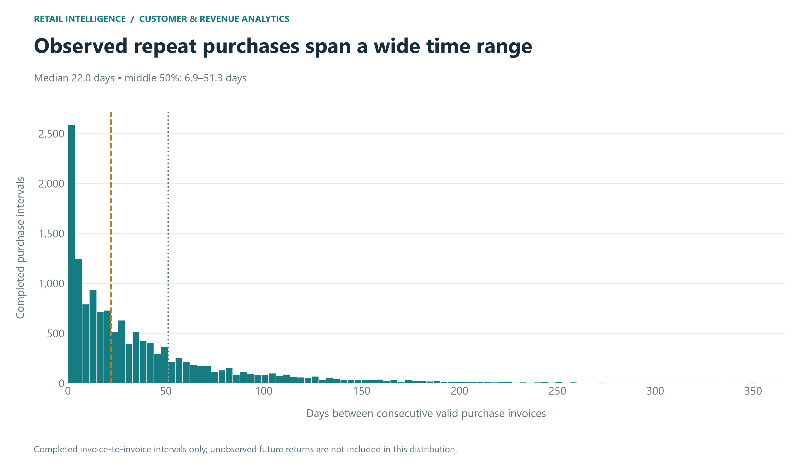
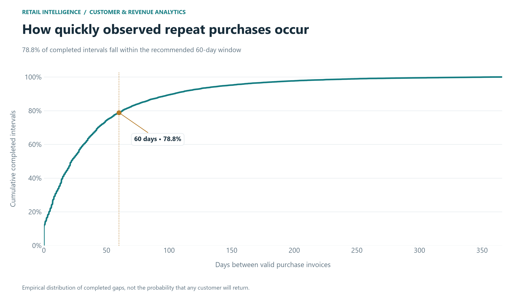
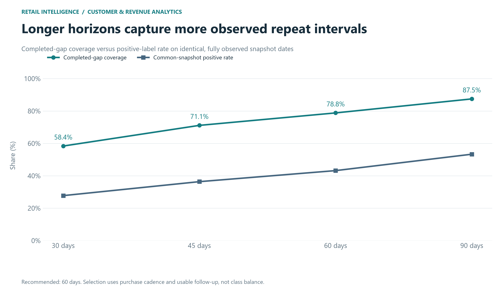

# Phase 5A — Repeat-purchase target and horizon selection

## Decision

Recommend **60 days**, conditional on the monthly existing-customer snapshot design below. The observed median invoice-to-invoice gap is 22.01 days; the 75th percentile is 51.28 days. The selected horizon is the shortest supplied candidate at or above that upper quartile, capturing 78.82% of completed repeat intervals. The upper-quartile criterion is an explicit operational trade-off, not a statistically unique optimum: allow most observed repeat cycles while retaining timely intervention and more evaluable historical snapshots than a longer window. Class balance is reported as a consequence, never optimized. A campaign budget or deployment cadence could justify revisiting this choice.

## Purchase occasions and empirical evidence

Use the existing is_customer_purchase flag unchanged. Aggregate each (CustomerID, InvoiceNo) to its earliest valid timestamp, so invoice line items are not separate occasions. Sort by customer, timestamp, then invoice. Distinct invoices on the same day remain separate occasions, including simultaneous invoices; report zero and sub-day gaps and a calendar-day sensitivity check. Fractional-day gaps preserve source timestamps.

| measure | value |
| --- | --- |
| eligible_customers | 4334 |
| repeat_customers | 2829 |
| purchase_occasions | 18405 |
| completed_interpurchase_intervals | 14071 |
| median_days | 22.01388888888889 |
| mean_days | 40.22861889899636 |
| p25_days | 6.923611111111111 |
| p75_days | 51.280208333333334 |
| p90_days | 103.87083333333334 |
| min_days | 0.0 |
| max_days | 365.9819444444444 |
| zero_day_gaps | 122 |
| under_one_day_gaps | 1900 |
| observation_start | 2010-12-01 08:26:00 |
| observation_end | 2011-12-09 12:50:00 |
| snapshot_dates | 12 |
| common_last_snapshot | 2011-09-01 00:00:00 |
| recommended_horizon_days | 60 |
| criterion | Shortest candidate at or above the observed completed-gap 75th percentile; balance is diagnostic only. |
| calendar_day_sensitivity | {'intervals': 12345, 'median_days': 28.0, 'p75_days': 58.0, 'recommended_by_same_criterion': 60} |

| within_days | completed_interval_pct |
| --- | --- |
| 7.00 | 25.80 |
| 14.00 | 38.36 |
| 30.00 | 58.38 |
| 45.00 | 71.13 |
| 60.00 | 78.82 |
| 90.00 | 87.46 |

The distribution counts completed intervals, so frequent buyers contribute multiple gaps. One-time buyers and the unfinished last waiting interval of every customer do not contribute completed gaps. This selection and right-censoring bias tends to favor shorter observed intervals. It is not a customer return-probability estimate. Snapshot labels below explicitly include customers with no subsequent purchase only when follow-up is complete. Calendar-day sensitivity checks whether multiple invoices drive the recommendation.

## Target and snapshot design

At each calendar-month start t, include every identified customer with at least one valid purchase strictly before t. The target is **1 if a valid customer purchase occurs in [t, t + H days), otherwise 0**, but only when t + H is no later than the last observed ledger timestamp. Feature history is [dataset start, t), strictly excluding target purchases. Customers may contribute multiple monthly snapshots. January 2011 is the first cutoff: it follows the first observed calendar month; December 2011 is the last candidate cutoff. Monthly cadence represents a recurring retention decision rather than an immediate post-order trigger.

Snapshot design affects class balance and observation count; these results do not apply automatically to order-triggered scoring. The eligible customer population expands with observed purchases and includes inactive customers, without an arbitrary recent-activity filter.

## Candidate comparison

| horizon_days | completed_gap_coverage_pct | eligible_snapshots | censored_snapshots | eligible_customers | positive | negative | positive_pct | fully_observed_snapshot_dates | last_eligible_snapshot |
| --- | --- | --- | --- | --- | --- | --- | --- | --- | --- |
| 30.00 | 58.38 | 28,144.00 | 4,293.00 | 3,970.00 | 8,021.00 | 20,123.00 | 28.50 | 11.00 | 2011-11-01 00:00:00 |
| 45.00 | 71.13 | 24,174.00 | 8,263.00 | 3,613.00 | 8,893.00 | 15,281.00 | 36.79 | 10.00 | 2011-10-01 00:00:00 |
| 60.00 | 78.82 | 24,174.00 | 8,263.00 | 3,613.00 | 10,591.00 | 13,583.00 | 43.81 | 10.00 | 2011-10-01 00:00:00 |
| 90.00 | 87.46 | 20,561.00 | 11,876.00 | 3,314.00 | 10,964.00 | 9,597.00 | 53.32 | 9.00 | 2011-09-01 00:00:00 |

30 days supports a short monthly conversion decision; 45 days extends it into roughly six weeks; 60 days covers roughly two months; 90 days is a slower quarterly follow-up decision. Longer windows can include more purchase cycles but postpone outcome availability, discard more late snapshots, and create more overlap between adjacent labels. All candidates require the same strict censoring rule.

### Matched-date and history sensitivity

| horizon_days | common_snapshot_count | common_positive | common_negative | common_positive_pct | min_dataset_history_days | max_dataset_history_days | median_customer_history_days | single_prior_order_pct | after_first_three_snapshots_count | after_first_three_snapshots_positive_pct |
| --- | --- | --- | --- | --- | --- | --- | --- | --- | --- | --- |
| 30.00 | 20,561.00 | 5,709.00 | 14,852.00 | 27.77 | 30.65 | 334.65 | 122.35 | 47.88 | 24,280.00 | 28.05 |
| 45.00 | 20,561.00 | 7,482.00 | 13,079.00 | 36.39 | 30.65 | 303.65 | 114.31 | 49.34 | 20,310.00 | 36.04 |
| 60.00 | 20,561.00 | 8,883.00 | 11,678.00 | 43.20 | 30.65 | 303.65 | 114.31 | 49.34 | 20,310.00 | 43.09 |
| 90.00 | 20,561.00 | 10,964.00 | 9,597.00 | 53.32 | 30.65 | 273.65 | 104.52 | 50.94 | 16,697.00 | 52.37 |

Common-date comparisons end at 2011-09-01 00:00:00; the customer/date population is identical across horizons. The additional warm-up sensitivity excludes the first three monthly cutoffs (January–March) solely to assess limited initial history; it does not silently change the primary population. It is a history-design sensitivity, not a prediction-window assumption.

## Selected target population

24,174 fully observed customer snapshots across 10 dates and 3,613 distinct customers. Positive: 10,591 (43.81%); negative: 13,583 (56.19%). Censored/excluded for this horizon: 8,263.

## Censoring policy

Every insufficient-follow-up snapshot retains a null target, even if an early repeat purchase is visible. This conservative complete-window policy keeps eligibility independent of whether a positive event happens early. No incomplete snapshot is labeled negative. The complete-window boundary uses the actual maximum ledger timestamp, not a fabricated month end. Customer disappearance before that date cannot be distinguished from nonpurchase. A negative means no observed valid purchase in the window, not churn.

## Leakage-free feasibility and suitability

This dataset is suitable for a limited historical repeat-purchase propensity exercise, with observed-purchase rather than true churn labels. Recency, cumulative order frequency, gross purchase value, prior returns and tenure can later be calculated from events strictly before each cutoff. Only snapshot metadata is saved now; no feature matrix or model is trained. Earliest cutoffs have only about one observed month of history, so long-lookback seasonal features are not supported everywhere. Newer customers also have short histories and require exposure-aware features.

Do not merge full-window Phase 3 customer features or Phase 4 RFM segments into training snapshots: those contain future information. Do not expose next_observed_purchase, target_end-derived future facts, gap outcomes, or target columns as predictors. Use forward calendar splits; training label windows must finish before the validation scoring period. Fit transformations only on training data. Adjacent monthly labels overlap, and customers recur: row count overstates independent sample size; uncertainty must account for customer/time dependence. The one-year history offers few independent forward evaluation periods and limited seasonality evidence.

A censored time-to-next-purchase analysis is a defensible complementary target because it retains terminal censored spells and avoids a fixed horizon. It does not eliminate short history or missing identities, and is not so clearly superior that the requested binary repeat-purchase objective should be replaced. No objective change is made. Reassess feasibility during temporal feature/split design before any claim of predictive performance.

## Files and reproduction

Run python scripts/run_phase5a.py in the project environment. Outputs: phase5a_purchase_occasions.csv and phase5a_candidate_snapshots.csv.gz under data/processed; phase5a_target_selection.json, phase5a_horizon_comparison.csv and phase5a_snapshot_dates.csv under reports/metrics. The snapshot table is an assessment/label ledger, not a model-ready feature matrix. All prior artifact hashes are verified and stored in the new JSON. Tests are written to a separate phase5a_test_results.json to preserve previous reports.

## Figures

Stopped after target selection. No classifiers, SHAP, dashboard, or deployment.
