# Phase 5B — Leakage-safe repeat-purchase prediction

## Business question and target

Estimate the probability that an already observed customer makes a valid purchase during the next 60 days. This supports a retention-review queue; it does not predict verified churn or treatment response. Phase 5A selected 60 days from the observed purchase cadence: median 22.01 days, 75th percentile 51.28 days, and 78.82% completed-gap coverage. These earlier results remain unchanged.

The Phase 5B target follows the newly requested interval **(snapshot_date, snapshot_date + 60 days]**. Features use timestamps strictly less than snapshot_date. This differs from Phase 5A's [start, end) convention; re-evaluation on the real eligible snapshots changed **0 labels**. Phase 5A files were not edited. Only its fully observable 60-day snapshots are used; the same 8,263 insufficient-follow-up observations are excluded. No incomplete observation is labeled negative.

## Temporal design

| split | first_snapshot | last_snapshot | last_outcome_end | snapshots | customers | positive | negative | positive_pct |
| --- | --- | --- | --- | --- | --- | --- | --- | --- |
| embargo | 2011-05-01 00:00:00 | 2011-08-01 00:00:00 | 2011-09-30 00:00:00 | 5,577.0000 | 3,145.0000 | 2,380.0000 | 3,197.0000 | 42.6753 |
| test | 2011-09-01 00:00:00 | 2011-10-01 00:00:00 | 2011-11-30 00:00:00 | 6,927.0000 | 3,613.0000 | 3,170.0000 | 3,757.0000 | 45.7630 |
| train | 2011-01-01 00:00:00 | 2011-04-01 00:00:00 | 2011-05-31 00:00:00 | 5,996.0000 | 2,132.0000 | 2,789.0000 | 3,207.0000 | 46.5143 |
| validation | 2011-06-01 00:00:00 | 2011-07-01 00:00:00 | 2011-08-30 00:00:00 | 5,674.0000 | 2,958.0000 | 2,252.0000 | 3,422.0000 | 39.6898 |

Training snapshots are January 1 through April 1, 2011. Validation snapshots are June 1 and July 1. Test snapshots are September 1 and October 1. May and August are embargoed. Latest training outcome ends May 31, before validation begins June 1; latest validation outcome ends August 30, before test begins September 1. Test outcomes end November 30, within actual source coverage. Embargo rows are saved for audit but never fitted or scored.

Customers can recur across periods because the intended use is predicting behavior of existing customers. Customer ID is never a predictor. Adjacent windows within a split overlap, so rows are not independent observations. A customer-disjoint split would answer a different cold-customer question. All model choices were persisted in phase5b_models/decision.json before first test prediction. No test-based winner switching or retraining occurred.

## Feature contract

**22 input features**, expanded to **27** for the selected model through missingness indicators.

| feature | definition |
| --- | --- |
| recency_days | Snapshot minus latest historical purchase timestamp, fractional days. |
| purchase_frequency | Distinct historical valid purchase invoices; also represents total_orders, avoiding a duplicate predictor. |
| monetary_value | Sum of historical valid customer purchase line_revenue, gross merchandise scope. |
| total_items | Sum of historical valid purchase quantities. |
| average_order_value | Mean invoice-level gross purchase revenue. |
| average_items_per_order | Mean invoice-level item quantity. |
| median_order_value / max_order_value | Median and maximum historical invoice-level gross values. |
| customer_tenure_days | Snapshot minus first observed purchase, fractional days; also represents days_since_first_purchase. |
| average / median / std_days_between_purchases | Mean, median and sample standard deviation of ordered invoice gaps; unavailable statistics stay missing. |
| historical_return_count | Distinct identified nonduplicate cancellation/negative-quantity invoices strictly before cutoff; includes service/adjustment flags. |
| historical_return_rate | Historical reversal invoice count divided by historical valid purchase invoice count; ratio, not matched-order probability. |
| historical_returned_value | Sum of the existing return_cancellation_value for historical identified reversal rows. |
| historical_dataset_days | Elapsed days from observed source start to cutoff; exposure proxy. |
| orders_previous_30/60/90_days | Distinct historical valid invoices in [cutoff - window, cutoff); missing if source coverage is shorter than the window. |
| history_30/60/90_days_complete | 1 when the whole historical window lies inside the observed source coverage, otherwise 0. |

Invoice lines are grouped by (CustomerID, InvoiceNo), with earliest timestamp as the occasion. Every feature first restricts the ledger to InvoiceDate < cutoff. No full-window Phase 3 customer features, Phase 4 scores/segments, target-window purchases, future return records, or IDs enter the model. Historical-window exposure refers to dataset coverage; newly observed customers may still have short tenure. Gross values and historical reversal values retain the previously verified Phase 2 scopes.

## Models and preprocessing

Naive baseline: training-set class prior as the probability, majority class at 0.5. Logistic Regression provides a regularized linear benchmark. Random Forest captures nonlinear relationships and interactions with bounded-depth averaging. XGBoost provides a conservative boosted-tree comparison.

All preprocessing is fitted inside a pipeline on training data only. Median imputation adds missingness indicators; Logistic Regression additionally uses StandardScaler. All selected inputs are numeric, so no categorical encoding is needed. Missing purchase gaps and incomplete lookbacks are not fabricated zeros. Scaler parameters and imputation medians are verified against the training rows in tests.

Seed 42. Conservative search: Logistic Regression C=0.1/1 without weighting, plus one C=1 balanced-weight alternative; Random Forest 200 trees with max_depth 6/10, min_samples_leaf=20 and max_features=0.8; XGBoost 180 trees, depth 2/3, learning_rate=0.04, min_child_weight=20, subsample/column fraction=0.85, L2=5. No random CV, SMOTE, resampling, or test-set early stopping. Selected configurations and all validation trials are saved.

Training has 46.51% positives: imbalance is modest. The balanced Logistic Regression alternative did not beat the selected unweighted C=0.1 configuration on validation average precision, so the simpler unweighted setup was retained. Forest and boosting also remain unweighted.

## Validation selection

| model | roc_auc | average_precision | precision | recall | f1 | accuracy | brier |
| --- | --- | --- | --- | --- | --- | --- | --- |
| Naive | 0.5000 | 0.3969 | 0.0000 | 0.0000 | 0.0000 | 0.6031 | 0.2440 |
| Logistic Regression | 0.7480 | 0.7038 | 0.6391 | 0.5906 | 0.6139 | 0.7051 | 0.1991 |
| Random Forest | 0.7500 | 0.7062 | 0.6074 | 0.6505 | 0.6282 | 0.6944 | 0.1999 |
| XGBoost | 0.7529 | 0.7055 | 0.6091 | 0.6470 | 0.6275 | 0.6951 | 0.1985 |

**Random Forest** was selected by validation average precision, not accuracy. Its lead over XGBoost is small; the ranking is not evidence of statistically significant superiority. Selected forest: depth 6, 200 trees, minimum leaf size 20.

## Frozen test comparison

All four rows below use raw model probabilities and a common diagnostic threshold of 0.50. AP means Average Precision, not trapezoidal PR area. Precision, recall and F1 use repeat purchase as the positive class.

| model | roc_auc | average_precision | precision | recall | f1 | accuracy | brier | TN / FP / FN / TP |
| --- | --- | --- | --- | --- | --- | --- | --- | --- |
| Naive | 0.5000 | 0.4576 | 0.0000 | 0.0000 | 0.0000 | 0.5424 | 0.2483 | 3757 / 0 / 3170 / 0 |
| Logistic Regression | 0.7316 | 0.7287 | 0.6934 | 0.5792 | 0.6311 | 0.6902 | 0.2142 | 2945 / 812 / 1334 / 1836 |
| Random Forest | 0.7350 | 0.7319 | 0.6383 | 0.6681 | 0.6529 | 0.6749 | 0.2077 | 2557 / 1200 / 1052 / 2118 |
| XGBoost | 0.7393 | 0.7364 | 0.6486 | 0.6631 | 0.6557 | 0.6814 | 0.2053 | 2618 / 1139 / 1068 / 2102 |

XGBoost has slightly higher test discrimination, but the validation-selected Random Forest remains the final model. Selecting XGBoost after seeing these test results would misuse the holdout.

## Calibration

Logistic sigmoid calibration maps the raw winner probability's logit to observed outcomes. It is fitted on June validation predictions only and assessed on July. July Brier changes from 0.200329 to 0.188467; calibration was adopted because improvement exceeded the predeclared 0.001 threshold. No test labels fit the calibrator. The calibrator is not refitted on July.

June and July are validation/tuning data, not an independent final calibration test: model selection already considered both months and their customer outcome windows overlap. This can make the internal calibration comparison optimistic. Its out-of-period check is the frozen September–October test. Do not interpret July improvement as unbiased forward performance. The final test calibration curve is inspection only and triggers no recalibration.

Test Brier: raw winner 0.207667; calibrated winner 0.204293. Calibration is not perfect and later-period drift remains visible. Brier combines calibration and discrimination, so a lower value does not by itself prove perfect reliability.

## Business threshold and action interpretation

Selected threshold: **0.650**. Repeat probability at or above this threshold predicts repeat purchase; a lower score flags a retention-review candidate. The objective maximizes July validation F1 for **nonrepeat** observations across thresholds 0.10–0.90 in 0.025 increments, with lower-threshold tie-breaking. It is a transparent provisional screening criterion, not an economic optimum.

Validation review precision 71.23%, recall 93.86%; review fraction 81.91%. This is broad screening. Without campaign cost, capacity or treatment-effect data, do not automatically contact everyone flagged or claim they would benefit. The saved trade-off table supports a later capacity-aware decision.

### Final model at the selected threshold (repeat is positive)

| metric | value |
| --- | --- |
| roc_auc | 0.7349505738604448 |
| average_precision | 0.7318754890213032 |
| precision | 0.8082386363636364 |
| recall | 0.3589905362776025 |
| f1 | 0.49716033202271737 |
| accuracy | 0.66767720513931 |
| brier | 0.204293097280858 |
| confusion_matrix | [[3487, 270], [2032, 1138]] |

### Same decisions viewed as a nonrepeat review queue

| precision | recall | f1 | review_fraction | review_count |
| --- | --- | --- | --- | --- |
| 0.6318 | 0.9281 | 0.7518 | 0.7967 | 5,519.0000 |

Probability bands use July validation terciles: low < 0.267695, medium from 0.267695 to < 0.504298, high >= 0.504298. These are relative propensity bands, not universally high/low calibrated confidence. They are separate from the action threshold and are not adjusted to test quantiles.

## SHAP explanations

Exact TreeSHAP explains the selected Random Forest using its training-path distribution. Contributions are in **raw tree probability space**, not the calibrated probability. Across 6,927 test rows, base value plus contributions reconstructs raw predictions with maximum absolute error 1.78e-15. The calibrator monotonically transforms that probability; SHAP values are not falsely relabeled as additive calibrated-probability effects.

| feature | mean_absolute_shap |
| --- | --- |
| purchase_frequency | 0.0698 |
| missingindicator_average_days_between_purchases | 0.0534 |
| missingindicator_median_days_between_purchases | 0.0533 |
| monetary_value | 0.0360 |
| recency_days | 0.0237 |
| customer_tenure_days | 0.0173 |
| total_items | 0.0108 |
| average_items_per_order | 0.0094 |
| average_order_value | 0.0083 |
| median_order_value | 0.0081 |

Missing mean-gap and median-gap indicators largely represent the same one-order-history condition. Their importance is shared among correlated proxies and should not be read as independent behavioral mechanisms. SHAP explains features driving the model's prediction, not causal reasons for behavior.

| role | customer_id | snapshot_date | raw_tree_probability | final_probability | actual_label |
| --- | --- | --- | --- | --- | --- |
| high_repeat_probability | 16839 | 2011-10-01 | 0.9820 | 0.9669 | 1.0000 |
| low_repeat_probability | 17536 | 2011-10-01 | 0.1491 | 0.1241 | 0.0000 |
| borderline_customer | 17231 | 2011-10-01 | 0.7371 | 0.6500 | 1.0000 |

Global importance uses all test snapshots. The summary plot displays a fixed sample of up to 600 real rows; vertical jitter only separates marks and does not alter data. High/low/borderline examples are selected by final calibrated scores; their contribution plots correctly show the underlying raw tree probability.

## Customer action table

data/processed/phase5b_customer_actions.csv contains test customer_id, snapshot_date, actual_label, raw_model_probability, predicted_probability, predicted_class, action_candidate, opportunity_band, historical features, and the three largest signed model-driving contributions. No customer is labeled churned. This is a historical analytical table, not a live campaign list. Future dates cannot receive actual_label until follow-up completes.

## Limitations and interpretation

The source covers roughly one year; only two calendar test cutoffs exist, and observations share customers and overlapping 60-day outcomes. No IID confidence intervals or causal campaign benefits are claimed. Aggregate behavior and target selection were explored in prior phases across this dataset: the temporal holdout is untouched during Phase 5B model tuning, but it is not pristine external data untouched by all project exploration. Independent future data is needed for stronger performance claims.

Customer identity is missing on part of the raw ledger; first purchases are left-censored; negative means no observed valid purchase, not true churn. Historical exposure is short for early snapshots, and time/exposure proxies may drift or saturate outside the training range. Several input features and missingness indicators are correlated. Calibration and the threshold were tuned on limited validation data. The broad review queue and modest model differences require business validation before use.

## Reproduction and artifacts

Install into the isolated environment with python -m pip install -r requirements-phase5b.txt. Run scripts/run_phase5b.py, then scripts/explain_phase5b.py, scripts/document_phase5b.py, and scripts/run_phase5b_tests.py. Reproduction retrains the fixed procedure; do not use reruns to optimize against test results.

New modeling modules: models/features.py, evaluation.py, training.py, plots.py. Saved pipelines, calibrator, frozen decision and trial table are in data/processed/phase5b_models/ (already covered by the processed-data gitignore). Feature/snapshot and prediction tables are prefixed phase5b. Metrics, SHAP importance, split counts, action metrics and test results use reports/metrics/phase5b_*; no previous results are overwritten.

## Technical references

[Scikit-learn probability calibration](https://scikit-learn.org/stable/modules/calibration.html) documents disjoint classifier/calibrator fitting and reliability assessment. [SHAP TreeExplainer](https://shap.readthedocs.io/en/stable/generated/shap.TreeExplainer.html) documents model-output scales and perturbation choices.

## Figures

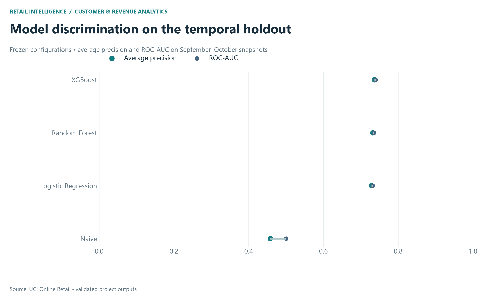

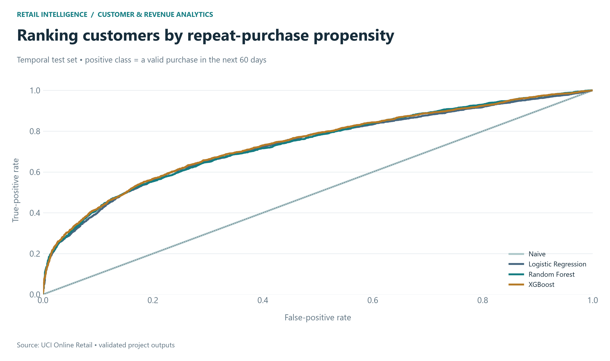

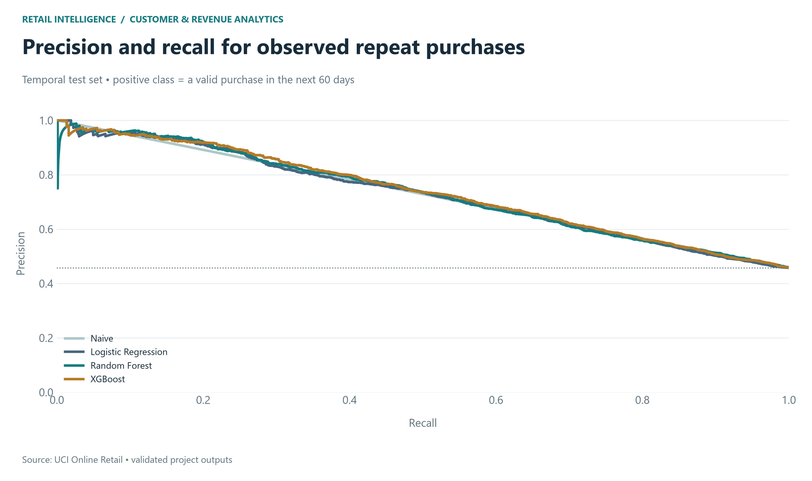

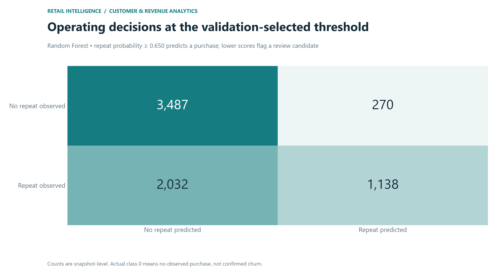

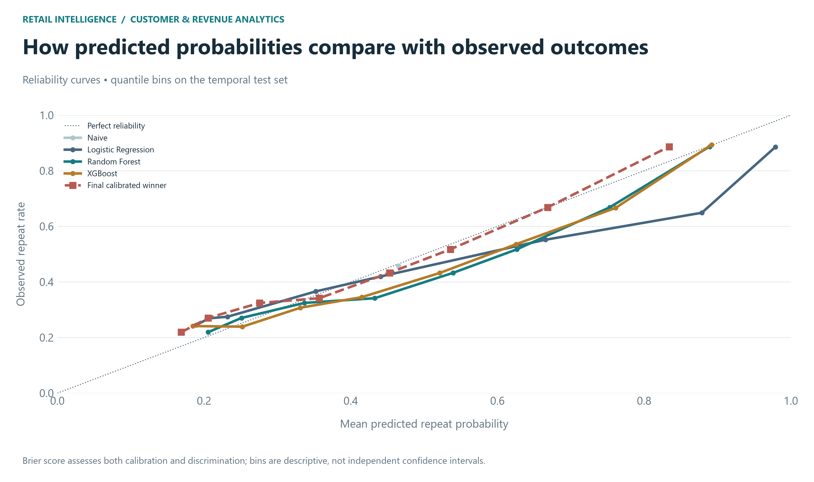

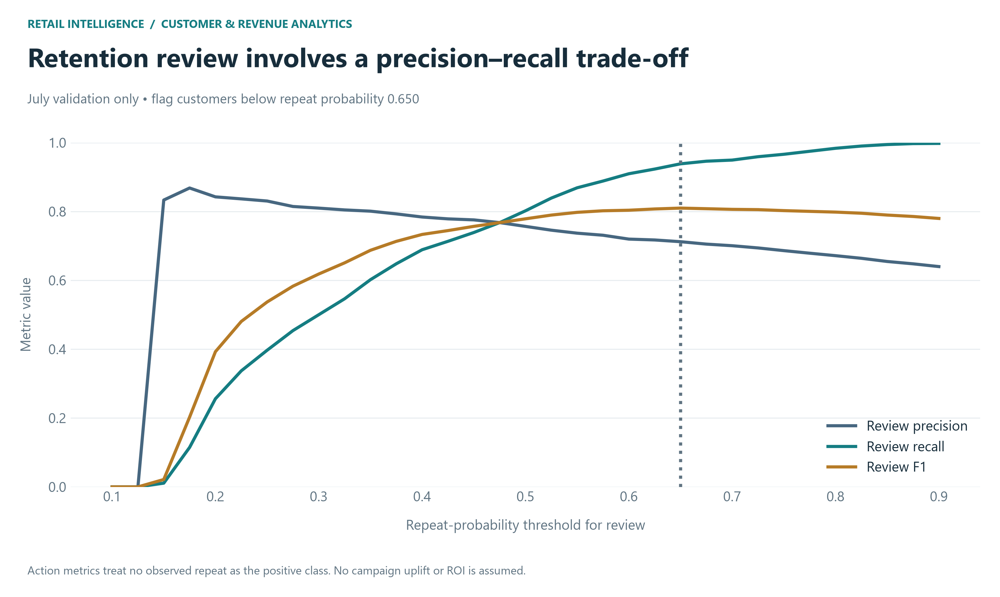

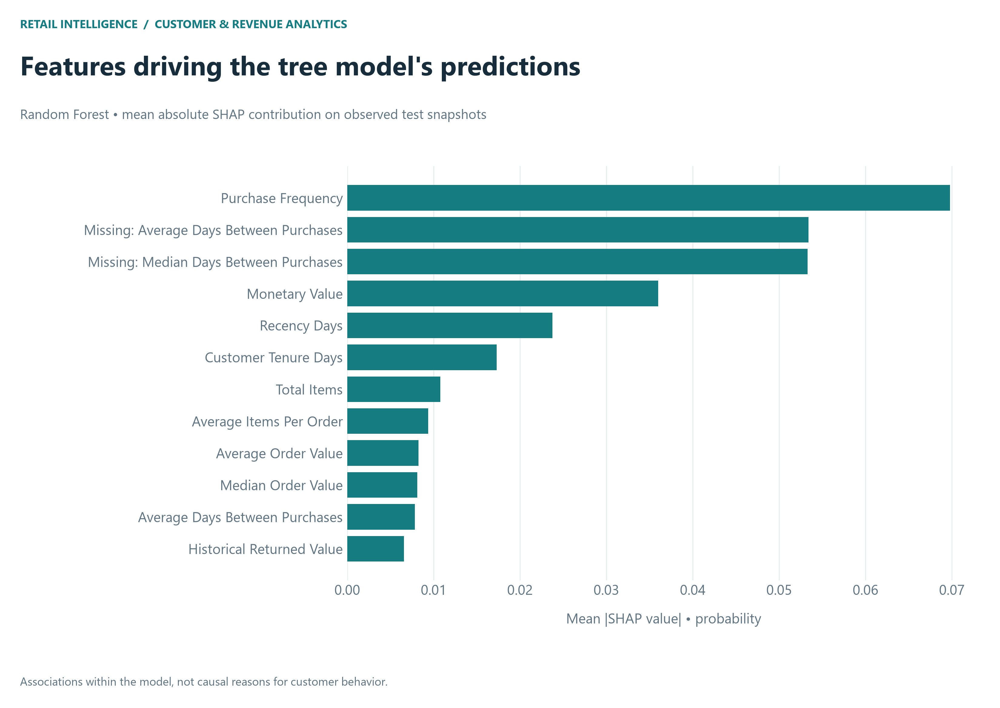

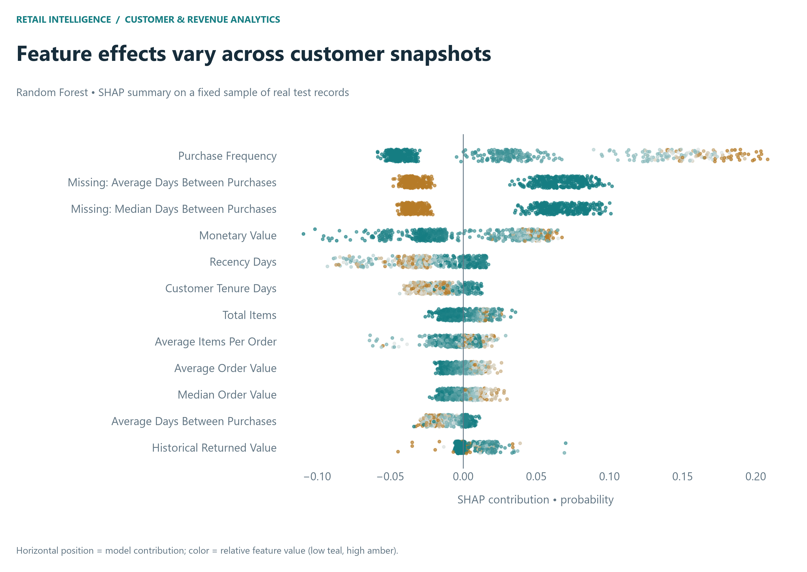

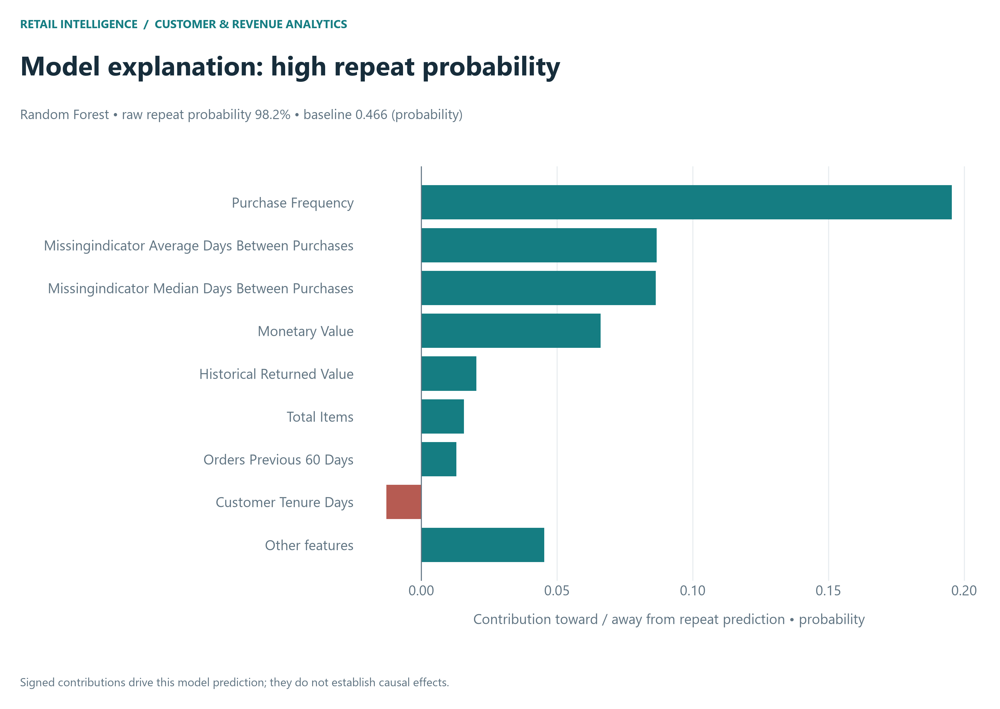

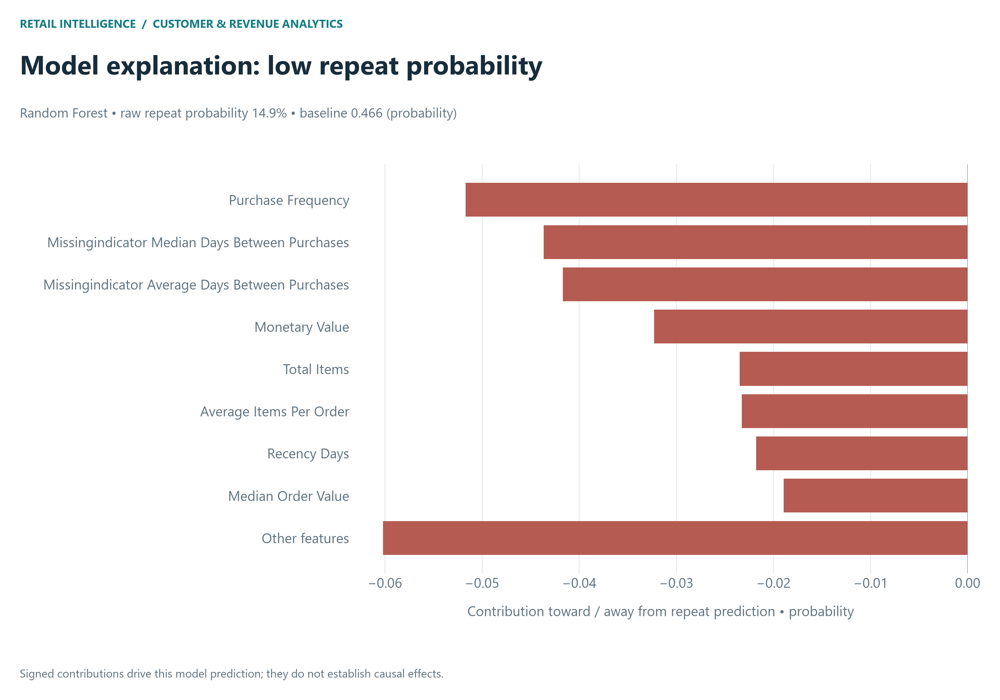

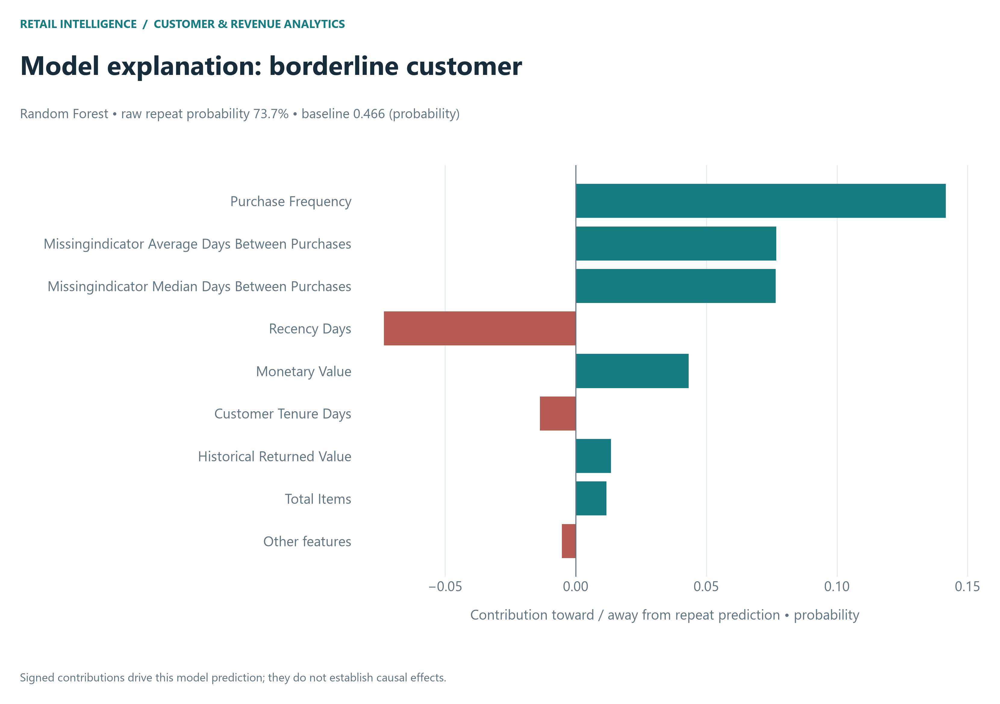

Stopped after Phase 5B. No Streamlit, deployment or GitHub push.

## Verification

Full Phase 2–5B suite: 51 passed, 0 failed, 0 errors. All 11 new charts were visually reviewed in their 300-DPI PNG exports; editable SVGs are also saved. Previous artifacts passed SHA-256 preservation checks.
